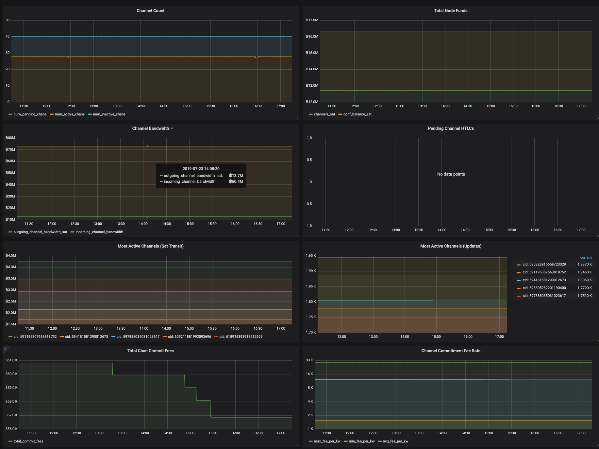

# lndmon

#### A drop-in monitoring solution for your lnd node that integrates with Prometheus and Grafana.



## What is this?

`lndmon` is a drop-in, monitoring/metric collection solution for your
individual lnd nodes connected to bitcoin which allows you to closely monitor
the health and status of your `lnd` node.

There are four primary components of this monitoring system:

1. [lnd](https://github.com/lightningnetwork/lnd) built with the `monitoring`
     tag, which enables lnd to export metrics about its gRPC performance and
     usage.
   - These metrics provide insights such as how many bytes lnd is transmitting
     over gRPC, whether any calls are taking a long time to complete, and other
     related statistics.
   - `lnd` build notes:
      * If you are using a release build of `lnd` or `litd`, this was enabled
        during build and no action is required.
      * If you are building from source, make sure to include the `monitoring`
        tag (i.e. `make && make install tags=monitoring`)
   - Default `lnd` config options:
      * `prometheus.enable=false`
         - Need to change to `true` to enable.
      * `prometheus.listen=127.0.0.1:8989`
         - You may want to change to `0.0.0.0:8989` to listen on all interfaces.
      * `prometheus.perfhistograms=false`
         - Enabling this uses more RAM and disk space.
   - Note: This data can be obtained from `lnd` without `lndmon` being
     installed.

2. `lndmon`: while lnd provides some information about gRPC performance
   statistics directly via its own prometheus exporter, `lndmon` by far does
   the heavy lifting with regards to metrics.
   - With `lndmon`'s data, you can track routing fees over time, track how the
     channel graph evolves, and have a highly configurable "crystal ball" to
     forecast and de-escalate potential issues as the network changes over time.
   -  There is also a strong set of metrics for users who want to keep track of
      their own node and channels, or just explore and create their own
      lightning data visualizations.
   - See [Options](#options) below for `lndmon` config options.
   - Note: This data can be obtained without lnd being built with the
     `monitoring` tag and without the `prometheus.enable` config option enabled,
     but it does require `lnd` to be listening for gRPC connections.

3. Prometheus is a time series database that scrapes data from `lnd` and
  `lndmon` and stores it for later analysis.

4. `lndmon` uses [Grafana](https://grafana.com/) as its
   primary dashboard to display all its collected metrics. Grafana is highly
   configurable and can create beautiful and detailed graphs organized by
   category (i.e., chain-related graphs, fee-related graphs, etc). Users have
   the option of making their Grafana dashboards remotely accessible over TLS
   with passwords to ensure their data is kept private.


# Architectural Layout
```
                                             gRPC Server (TCP/10009)  ╔══════════════════════╗           
           ┌──────────────────────────────────────────────────────────║         LND          ║           
           │                                                          ╚══════════════════════╝           
           │                                                                     │  Prometheus           
           │                                                                     │  Exporter             
           │                                                                     │  (TCP/8989)           
           │                                                                     │                       
           │                                                                     │                       
           │                                                                     │                       
           │                                                         ┌───────────┴────────────┐          
           │                                                         │ gRPC performance stats │          
           │                                                         └───────────┬────────────┘          
           │                                                                     │                       
           │                                                                     │                       
           │                                                                     │                       
           │                                                                     │                       
           │                                                                     │                       
      gRPC │                                                                     │  Prometheus           
    Client ▼            Prometheus                                               ▼  Scraper              
╔═════════════════════╗ Exporter                                      ╔══════════════════════╗           
║                     ║ (TCP/9092)    ┌────────────────┐              ║                      ║           
║       LNDmon        ║ ──────────────┤ gRPC call data ├─────────────►║      Prometheus      ║           
║ (aggregate, cache)  ║               └────────────────┘   Prometheus ║   (time series DB)   ║           
║                     ║                                       Scraper ║                      ║           
╚═════════════════════╝                                               ╚══════════════════════╝           
                                                                            http │                       
                                                                          Server │                       
                                                                      (TCP/9090) │                       
                                                                                 │                       
                                                                                 │                       
                                                                                 │                       
                                                                                 │                       
                                                                            http │                       
                                                                          Client ▼                       
                                                                      ╔══════════════════════╗           
                                                                      ║                      ║           
                                                                      ║       Grafana        ║           
                                                                      ║(dashboard generation)║           
                                                                      ║                      ║           
                                                                      ╚══════════════════════╝           
                                                                            http │                       
                                                                          Server │                       
                                                                      (TCP/3000) │                       
                                                                                 │                       
                                                                                 │                       
                                                                                 │                       
                                                                                 │                       
                                                                            http │                       
                                                                          Client ▼                       
                                                                      ╔══════════════════════╗           
                                                                      ║                      ║           
                                                                      ║       Firefox        ║           
                                                                      ║ (dashboard display)  ║           
                                                                      ║                      ║           
                                                                      ╚══════════════════════╝           
```


## Why would I want to use this?

Monitoring can provide crucial insights into the health of large-scale
distributed systems. Without monitoring systems like `lndmon`, the only view
into the health of your lnd node and the overall network is (1) fragmented logs,
and (2) individually-dispatched `getinfo` and similar commands. By exporting and
graphing interesting metrics, one can get a real-time transparent view of the
behavior of your lnd node and the network. It's also cool to see how this view
changes over time and how it's affected by events in the larger bitcoin
ecosystem (i.e., "wow, the day [Lightning
App](https://github.com/lightninglabs/lightning-app) was released coincides with
the addition of 3000 channels to the network!").


## Build

```
git clone https://github.com/lightninglabs/lndmon
cd lndmon/cmd/lndmon
go build
```

## Options

```
$ lndmon -h
Usage:
  lndmon [OPTIONS]

Application Options:
      --primarynode=                                                 Public key of the primary node in a primary-gateway setup
      --disablegraph                                                 Do not collect graph metrics
      --disablehtlc                                                  Do not collect HTLCs metrics
      --disablepayments                                              Do not collect payments metrics

prometheus:
      --prometheus.listenaddr=                                       the interface we should listen on for prometheus (default:
                                                                     localhost:9092)
      --prometheus.logdir=                                           Directory to log output (default: /home/user/.lndmon/logs)
      --prometheus.maxlogfiles=                                      Maximum log files to keep (0 for no rotation) (default: 3)
      --prometheus.maxlogfilesize=                                   Maximum log file size in MB (default: 10)

lnd:
      --lnd.host=                                                    lnd instance rpc address (default: localhost:10009)
      --lnd.network=[regtest|testnet|testnet4|mainnet|simnet|signet] network to run on (default: mainnet)
      --lnd.macaroondir=                                             Path to lnd macaroons (default: /home/user/.lnd)
      --lnd.macaroonname=                                            The name of our macaroon in macaroon dir to use. (default:
                                                                     readonly.macaroon)
      --lnd.rpctimeout=                                              The timeout for rpc calls to lnd. Valid time units are {s,
                                                                     m, h}. (default: 30s)
      --lnd.tlspath=                                                 Path to lnd tls certificate

Help Options:
  -h, --help                                                         Show this help message
```


## How do I use this?

Head over to [`Docker_Usage.md`](https://github.com/lightninglabs/lndmon/blob/master/Docker_Usage.md)
for information on how to setup a dockerized version. It also includes
instructions to set up, access, and password-protect the dashboard that comes
with Prometheus, called the "Prometheus Expression Browser", for those interested
in using it.
